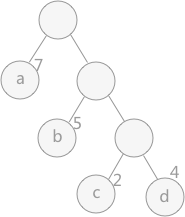

### what

哈夫曼树是一颗最优二叉树，带权路径长度最小的二叉树，经常来用来进行数据压缩。

### why

#### 为什么这棵树是最优的？

一个棵树是不是最优的，要看它是否满足构建的这棵树的带权路径长度最小。

在证明哈夫曼树是一颗最优二叉树之前，要先知道这几个概念：

* 路径：从树中一个节点到另一个节点之间的分支构成这两个节点之间的路径。
* 路径长度：从根节点开始计数到该节点，路径上的分支数目称作路径长度。
* 权：也称为权值，指的是节点的属性数值。
* 树的带权路径长度：树中所有叶子节点的带权路径长度之和，一般用WPL表示。

如上图中，a的权值为7，路径长度为1；b的权值为5，路径长度为2。

树的带权路径长度WPL=7x1+5x2+2x3+4x3=

#### 为什么可以用来进行数据压缩（无损压缩）？

<!-- more -->

